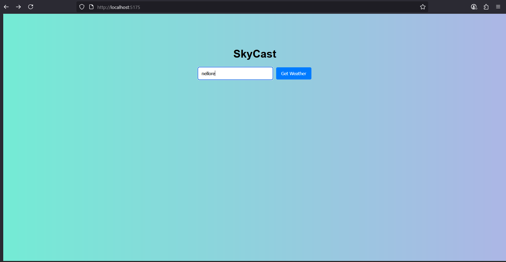
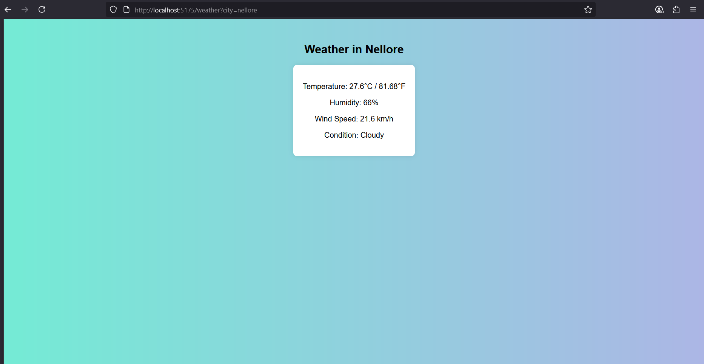

# SkyCast - Find My Weather
## Date: 24-07-2025
## Objective:
To build a responsive single-page application using React that allows users to enter a city name and retrieve real-time weather information using the OpenWeatherMap API. This project demonstrates the use of Axios for API calls, React Router for navigation, React Hooks for state management, controlled components with validation, and basic styling with CSS.
## Tasks:

#### 1. Project Setup
Initialize React app.

Install necessary dependencies: npm install axios react-router-dom

#### 2. Routing
Set up BrowserRouter in App.js.

Create two routes:

/ – Home page with input form.

/weather – Page to display weather results.

#### 3. Home Page (City Input)
Create a controlled input field for the city name.

Add validation to ensure the input is not empty.

On valid form submission, navigate to /weather and store the city name.

#### 4. Weather Page (API Integration)
Use Axios to fetch data from the OpenWeatherMap API using the city name.

Show temperature, humidity, wind speed, and weather condition.

Convert and display temperature in both Celsius and Fahrenheit using useMemo.

#### 5. React Hooks
Use useState for managing city, weather data, and loading state.

Use useEffect to trigger the Axios call on page load.

Use useCallback to optimize form submit handler.

Use useMemo for temperature conversion logic.

#### 6. UI Styling (CSS)
Create a responsive and clean layout using CSS.

Style form, buttons, weather display cards, and navigation links.

## Programs:
#### index.css:
```css
body {
  font-family: Arial, sans-serif;
  background: linear-gradient(to right, #74ebd5, #acb6e5);
  margin: 0;
  padding: 0;
  text-align: center;
}

.container {
  margin-top: 100px;
}

input {
  padding: 10px;
  width: 200px;
  border: none;
  border-radius: 4px;
  margin-right: 10px;
}

button {
  padding: 10px 15px;
  border: none;
  background-color: #007bff;
  color: white;
  border-radius: 4px;
  cursor: pointer;
}

button:hover {
  background-color: #0056b3;
}

.error {
  color: red;
  margin-top: 10px;
}

.weather-container {
  margin-top: 50px;
}

.card {
  display: inline-block;
  padding: 20px;
  border-radius: 8px;
  background-color: white;
  box-shadow: 0 0 10px rgba(0,0,0,0.1);
}

```
#### Weather.jsx
```js
import { useEffect, useState, useMemo } from 'react';
import axios from 'axios';
import { useLocation } from 'react-router-dom';

function Weather() {
  const location = useLocation();
  const queryParams = new URLSearchParams(location.search);
  const city = queryParams.get('city');

  const [data, setData] = useState(null);
  const [loading, setLoading] = useState(true);
  const API_KEY = "d160e2908c7d4290a75180856252107";

  useEffect(() => {
    if (city) {
      axios.get(`http://api.weatherapi.com/v1/current.json?key=${API_KEY}&q=${city}`)
        .then(res => {
          setData(res.data);
          setLoading(false);
        })
        .catch((err) => {
          console.error(err);
          setLoading(false);
        });
    }
  }, [city]);

  const temperatureF = useMemo(() => {
    if (data) {
      return (data.current.temp_c * 9 / 5 + 32).toFixed(2);
    }
    return null;
  }, [data]);

  if (loading) return <p>Loading...</p>;
  if (!data) return <p>Weather data not found.</p>;

  return (
    <div className="weather-container">
      <h2>Weather in {data.location.name}</h2>
      <div className="card">
        <p> Temperature: {data.current.temp_c}°C / {temperatureF}°F</p>
        <p> Humidity: {data.current.humidity}%</p>
        <p> Wind Speed: {data.current.wind_kph} km/h</p>
        <p> Condition: {data.current.condition.text}</p>
      </div>
    </div>
  );
}

export default Weather;

```
#### Home.jsx:
```js
import { useState, useCallback } from 'react';
import { useNavigate } from 'react-router-dom';

function Home() {
  const [city, setCity] = useState('');
  const [error, setError] = useState('');
  const navigate = useNavigate();

  const handleSubmit = useCallback((e) => {
    e.preventDefault();
    if (!city.trim()) {
      setError('City name cannot be empty');
    } else {
      setError('');
      navigate(`/weather?city=${city}`);
    }
  }, [city, navigate]);

  return (
    <div className="container">
      <h1>SkyCast </h1>
      <form onSubmit={handleSubmit}>
        <input
          type="text"
          placeholder="Enter city name"
          value={city}
          onChange={(e) => setCity(e.target.value)}
        />
        <button type="submit">Get Weather</button>
      </form>
      {error && <p className="error">{error}</p>}
    </div>
  );
}

export default Home;

```
#### App.jsx
```js
import { Routes, Route } from 'react-router-dom';
import Home from './pages/Home';
import Weather from './pages/Weather';

function App() {
  return (
    <Routes>
      <Route path="/" element={<Home />} />
      <Route path="/weather" element={<Weather />} />
    </Routes>
  );
}

export default App;

```
#### main.jsx:
```js
import React from 'react';
import ReactDOM from 'react-dom/client';
import App from './App';
import { BrowserRouter } from 'react-router-dom';
import './index.css';

ReactDOM.createRoot(document.getElementById('root')).render(
  <BrowserRouter>
    <App />
  </BrowserRouter>
);

```

## Output:





## Result:
A responsive single-page application using React that allows users to enter a city name and retrieve real-time weather information using the OpenWeatherMap API has been built successfully. 
